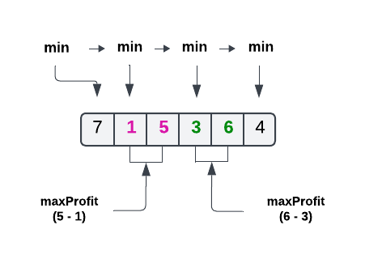

# Problem 122: Best Time to Buy and Sell Stock II


**LeetCode Problem Link**: [Problem URL](https://leetcode.com/problems/best-time-to-buy-and-sell-stock-ii)

---

## Problem Statement

### Description:
- You are given an integer array `prices`, where `prices[i]` represents the price of a given stock on the `ith` day.
- On each day, you may decide to buy and/or sell the stock. You can only hold at most one share of the stock at any time.
- You can buy the stock and immediately sell it on the same day.
- Find and return the maximum profit you can achieve.

---

## Approach

### Thought Process:

- **Initial Analysis**: This problem is similar to the [Best Time to Buy and Sell Stock](https://leetcode.com/problems/best-time-to-buy-and-sell-stock/), but with the assignment to make multiple transactions (buy and sell) as long as there is profit.

- **Challenges**: One key challenge was determining when to "reset" the minimum price and add to the total profit.

- **Optimizations**: The solution runs in **O(n)** time complexity, as we only need to traverse the array once. The space complexity is **O(1)** because we only use a few variables to track the minimum price, maximum profit for the current transaction, and total profit.

### Algorithm:

1. **Step 1**: Initialize two variables:
    - `min`: Tracks the minimum price seen so far.
    - `maxProfit`: Tracks the maximum profit for the current transaction.
    - `totalProfit`: Tracks the total profit accumulated from all completed transactions.

2. **Step 2**: Iterate through the `prices` array starting from the second element (`i = 1`):
    - Calculate the profit if we sold the stock today: `currentProfit = prices[i] - min`.
    - If `currentProfit` is greater than `maxProfit`, update `maxProfit`.
    - If `currentProfit` is not greater than `maxProfit` (i.e., prices have dropped or remained the same):
        - Add the `maxProfit` from the current transaction to the `totalProfit`.
        - Update `min` to the current price (`prices[i]`) to start a new potential transaction.
        - Reset `maxProfit` to 0.

3. **Step 3**: After the loop, the remaining `maxProfit` (if any) should be added to `totalProfit`.

### Code Implementation:

```javascript
// Solution in JavaScript
function maxProfit(prices) {
    let min = prices[0];
    let maxProfit = 0;
    let totalProfit = 0;

    for (let i = 1; i < prices.length; i++) {
        let currentProfit = prices[i] - min;

        if (currentProfit > maxProfit) {
            maxProfit = currentProfit;
        } else {
            totalProfit += maxProfit;
            min = prices[i];
            maxProfit = 0;
        }
    }

    return totalProfit + maxProfit; // Add remaining profit if there is any
}
